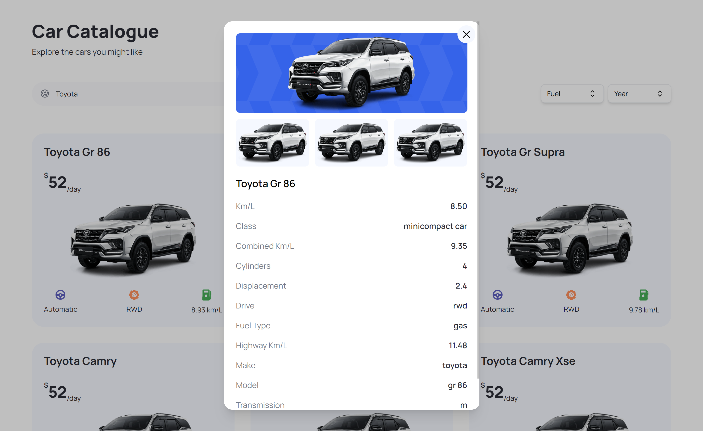

# Car Renter

## Структура проекта:
- **app/**: Корневая директория приложения с основными файлами конфигурации и запуска.
- **components/**: Содержит все компоненты приложения.
- **constants/**: Константы, используемые в приложении.
- **public/**: Статические файлы, такие как изображения и HTML файлы.
- **types/**: Определения типов для TypeScript.

## Основные части и функции:
- **Поиск**: Компонент для поиска машин.
- **Страницы машин**: Отображают подробную информацию о каждой машине.
- **Фильтры**: Компонент для фильтрации машин по параметрам.
- **Админ-панель**: Управление контентом через Strapi.

## Основные файлы:
- **CarCard.tsx**: Компонент для отображения информации о машине, включая название, изображение и характеристики.
- **CustomFilter.tsx**: Компонент для фильтрации списка машин по различным параметрам.
- **Hero.tsx**: Компонент для отображения главного баннера на главной странице.
- **SearchBar.tsx**: Компонент для поиска машин, использует `useState` для управления состоянием ввода и `useEffect` для обработки запроса поиска.
- **CarDetails.tsx**: Компонент для отображения детальной информации о выбранной машине.

## Основные компоненты и функции:
- **React**: Используется для создания компонентов и управления состоянием приложения.
- **Tailwind CSS**: Используется для стилизации компонентов.
- **Next.js**: Фреймворк для React, который используется для рендеринга и управления маршрутизацией.

## Технологии и их использование:
- **React**: Используется для создания компонентов и управления состоянием приложения.
- **Next.js**: Фреймворк для React, который обеспечивает серверный рендеринг и маршрутизацию.
- **Tailwind CSS**: Утилитарный CSS-фреймворк для быстрой стилизации компонентов.

Проект демонстрирует использование современных технологий для создания функционального и удобного сайта по аренде машин.

